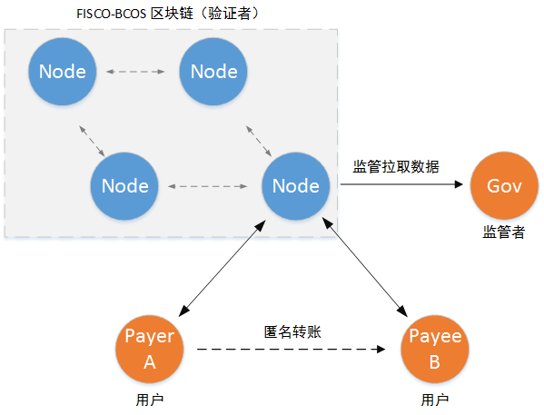
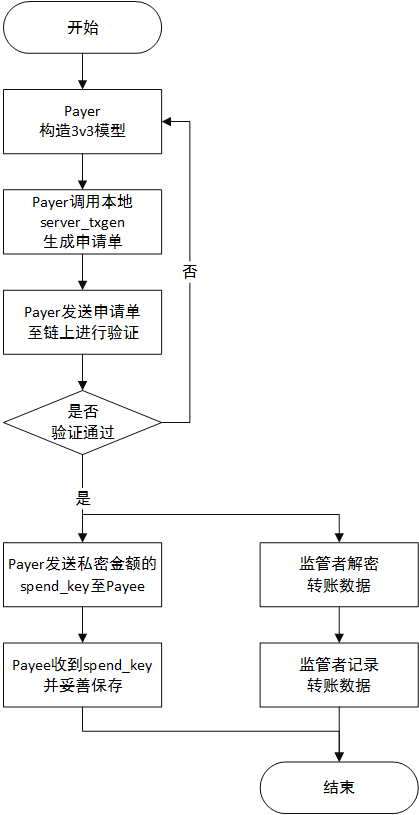
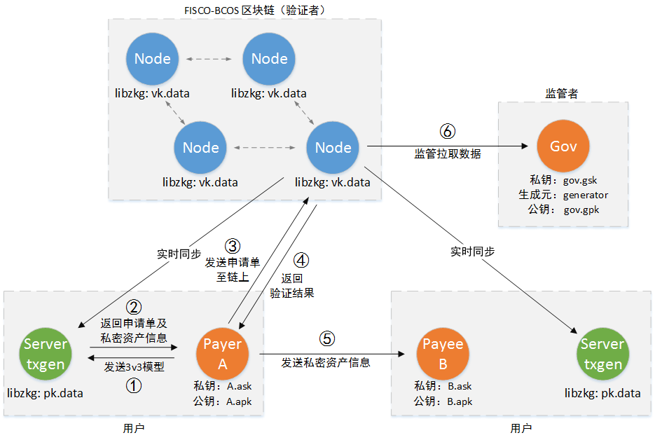

# 一对一匿名可监管转账

一对一匿名可监管转账，基于FISCO-BCOS的可监管零知识证明库libzkg实现。用户可在FISCO-BCOS区块链上进行匿名的转账操作。区块链节点可验证匿名转账的正确性，但不能获取匿名转账的信息。同时，只有监管者可解密匿名转账的内容，实现对匿名转账的监管。

注意：由于本项目基于的libzkg库目前处于原型验证版阶段，请勿将本项目直接应用于生产环境。

## 一、介绍

### 1.1 角色

一对一匿名可监管转账场景中有三种角色：

- 用户：发起匿名转账的双方，只有匿名转账的双方知道转账的金额和参与者。
- 验证者：即区块链节点，可验证每一笔匿名转账的正确性，但不能获取匿名转账的金额和参与者。
- 监管者：可解密所有已经上链的匿名转账内容，实现监管。

### 1.2 场景

​	场景如下图所示。用户通过FISCO-BCOS区块链进行匿名转账。监管者可解密链上匿名转账的内容，实现对匿名转账的监管。



### 1.3 功能

- 匿名：除交易双方和监管者之外，其他人无法知道交易的内容。
- 安全：链上所有的节点在无法知晓交易内容的情况下，可验证匿名交易的正确性。
- 可监管：监管者可解密所有匿名交易，对匿名交易实施监管。
- 灵活：提供的3v3模型可实现公开金额与私密金额的相互划转、私密金额的合账、拆账、找零。

### 1.4 模型

一对一匿名可监管转账场景，基于下述3v3交易模型。用户要进行一笔匿名转账时，则需构造此模型。

```log
KEYs:
               s_ask  ----->  r_apk
MODEL:                ______
S ---  vpub_old  --->|      |--- vpub_new ---> R
                     |      |
S --- s_v0, s_k0 --->|  Tx  |---  r_v     ---> R
                     |      |
S --- s_v1, s_k1 --->|______|---  change_v---> S (S change)
                        ||
                        \/ 
                      G_data
```

各字段描述如下

| 名称         | 描述            |
| ---------- | ------------- |
| S          | 金额发送者（Payer）  |
| R          | 金额接收者（Payee）  |
| s_ask      | 发送者私钥         |
| r_apk      | 接收者公钥         |
| vpub_old   | 公开输入金额        |
| vpub_new   | 公开输出金额        |
| s_v0, s_v1 | 私密输入金额        |
| s_k0, s_k1 | 要花费私密金额所需的key |
| r_v        | 接收者收到的金额      |
| change_v   | 找零金额          |
| G_data     | 监管者所需的密文      |


输入与输出的不同组合，可实现下述功能：

- 公开金额划转私密金额
- 私密金额划转公开金额
- 私密金额合账
- 私密金额拆账
- 私密金额转账并找零
- 上述场景的混合

### 1.5 转账流程

转账流程如下图所示，流程描述如下。

（1）金额发送者根据自身需要（公开私密划转、合账拆账、找零），确定3v3模型；

（2）金额发送者调用本地server_txgen，根据3v3模型生成匿名转账申请单；

（3）金额发送者将转账申请单发送到链上，给节点验证；

（4）区块链节点验证匿名转账申请单的有效性，并达成全网共识。若验证通过，则转账成功，进入（5）和（7），反之，申请单内容有误，验证不通过，需要重新构建申请单，返回（1）；

（5）金额发送者把接收者收到的金额所对应的spend_key，通过秘密信道发送给接收者；

（6）金额接收者妥善保管收到的金额和spend_key，供之后花费使用；进入（9）；

（7）监管者解密匿名转账数据；

（8）监管者记录匿名转账数据，实施监管；

（9）流程结束。





## 二、部署

根据场景角色，分别对应三个工程。

（1）[user：用户](user/README.md)

（2）[FISCO-BCOS节点：验证者](https://github.com/FISCO-BCOS/FISCO-BCOS)

（3）[gov：监管者](gov/README.md)

下面将分别给出三个工程的部署方法。

### 2.1 机器配置说明

系统：CentOS （7.2  64位）

user端内存：8G（最低配置），16G（推荐配置）

其它与FISCO-BCOS节点要求的机器配置一致

### 2.2 user & gov 部署

> 安装依赖包、下载代码

``` shell
sudo yum install -y procps-ng procps-ng-devel libgomp jq
git clone https://github.com/FISCO-BCOS/zkg-tx1to1.git
```

**user部署**

> 预编译、编译

```shell
cd zkg-tx1to1/user
mkdir build
cd build
cmake3 .. #注意后面有两个点“..”
make -j4
```

> 编译后build文件夹内会出现两个文件，表示部署成功

```shell
apkgen server_txgen
```

**gov部署**

> 预编译、编译

```shell
zkg-tx1to1/gov
mkdir build
cd build
cmake3 .. #注意后面有两个点“..”
make -j4
```

> 编译后build文件夹内会出现三个文件，表示部署成功

```shell
govdata pkvkgen gpkgen
```

### 2.3 FISCO-BCOS节点部署

FISCO-BCOS节点的部署请参考[FISCO-BCOS说明文档](https://github.com/FISCO-BCOS/FISCO-BCOS/blob/master/doc/manual/README.md)，在部署时，需增加两条指令。

> 安装依赖包

```shell
sudo yum install -y procps-ng procps-ng-devel libgomp jq
cd FISCO-BCOS/tool/
cnpm install json-bignum
```

> 编译节点时的cmake阶段，开启编译开关，使编译出来的FISCO-BCOS具备libzkg验证功能

``` shell
cmake3 -DZKG_VERIFY=ON ..
```

在编译成功后，进行常规搭链操作：部署系统合约，多节点组网。当搭链完成，一条链正常出块后，就可进入匿名转账操作步骤。


## 三、操作

操作分为两个阶段。

（1）准备阶段：区块链节点部署相应的key，用户公钥生成，监管者公钥生成。仅需一次。

（2）转账阶段：用户根据自身需要构造匿名转账，并发送至链上进行验证。

### 3.1 简要步骤

操作主要分成以下几步：

**准备阶段**

监管者：

（1）生成全局的key：pk、vk

（2）pk给到user

（3）vk给到到FISCO-BCOS节点

（4）监管者自定义私钥和生成元

（5）用工具生成监管者公钥

验证者（FISCO-BCOS节点）：

（1）部署vk、若节点未启动，则启动节点

（2）部署验证合约

每个用户：

（1）自定义私钥ask

（2）用工具生成公钥apk

（3）部署pk、启动本地的匿名交易生成端（server_txgen）

**转账阶段**

（1）金额发送者根据自身需求，构造3v3模型，请求本地server_txgen

（2）server_txgen生成匿名转账申请单和私密资金信息

（3）金额发送者将转账请求发送到链上

（4）验证者（节点）验证转账请求的正确性，实现转账功能

（5）金额发送者将私密资金信息（金额和spend_key）发送给接收者，接收者妥善保存收到的信息

（6）监管者拉取链上数据，解密匿名转账信息，知晓转账的内容



### 3.2 Setp by step

#### 3.2.1 准备阶段

##### 3.2.1.1 监管者

**（1）配置全局key**

``` shell
cd zkg-tx1to1/gov/build
```

> 生成libzkg所需的全局key：pk、vk。其中pk：生成匿名转账所需的key，vk：验证匿名转账所需的key。
>
> pkvkgen参数说明请参考：[监管端使用说明](gov/README.md) 

```shell
./pkvkgen pk.data vk.data #需要一段时间
```

> 得到pk、vk，验证大小是否正确

```shell
ll -h
#-rw-rw-r--  1 app app 251M Apr 16 16:32 pk.data
#-rw-rw-r--  1 app app 1023 Apr 16 16:32 vk.data
```

> pk拷贝给user

```shell
cp pk.data zkg-tx1to1/user/build/ #拷贝到user的build文件夹中
```

> vk拷贝给FISCO-BCOS节点，拷贝到每个节点的config.json中datadir指向的目录

```shell
cp vk.data /bcos-data/node0/data/ #拷贝到节点的data目录下
cp vk.data /bcos-data/node1/data/ #每个都要拷贝
cp vk.data /bcos-data/node2/data/ 
cp vk.data /bcos-data/node3/data/ 
```

**（2）配置监管者公私钥**

```shell
cd zkg-tx1to1/gov/build
```

> 监管者自定义私钥和生成元，此处为简单举例，记录到文件。注意：私钥必须是16进制数

```shell
echo "123456" > gov.gsk #自定义监管私钥，请妥善保存，此处为简单举例，记录到文件中
echo "39061f1c854fae629b599d29cefe1f12bc4809aa681809bfaaeb1b7087be6fed" > generator.key #自定义生成元，记录到文件里。生成元的选取，从附录的生成元列表中选择一个即可。
```

> 用工具生成公钥，使用说明请参考：[监管端使用说明](gov/README.md) 

```shell
./gpkgen 123456 39061f1c854fae629b599d29cefe1f12bc4809aa681809bfaaeb1b7087be6fed 
#用gov.gsk generator.key得到：9024aeaad0ad8f4cfb58d90ffc76e4c4e129cf3cdea8ec5de2c68c7cefe479d1
```

> 保存公钥

```shell
echo "9024aeaad0ad8f4cfb58d90ffc76e4c4e129cf3cdea8ec5de2c68c7cefe479d1" > gov.gpk
```

##### 3.2.1.3 验证者

**（1）部署vk、启动节点**

> 确认vk已经正确的放到**每个**节点的data目录下，即config.json中的datadir所指向的目录。第一次配置vk，无需重启节点。替换vk需重启节点。
>
> 若需替换vk请注意：替换vk需重启节点，请确保最后一个块中的交易不是基于libzkg的交易。重启节点会重放最后一个块的交易，替换vk会造成重启前后交易执行结果不一致。

**（2）部署验证合约**

> 切换到tool文件夹下

```shell
cd FISCO-BCOS/tool/
babel-node deploy.js TestZkg
```

##### 3.2.1.3 两个用户 A & B

```shell
cd user/build
```

**（1）配置用户公私钥**

> 将用户A和B的私钥（ask）保存在文件里（此处为了举例方便，保存在文件里，真实情况下请妥善保管私钥）
>
> 注意：私钥必须是16进制数

```shell
echo "111111" > A.ask
echo "222222" > B.ask
```

> 用工具生成公钥apk，使用说明请参考：[用户端使用说明](user/README.md)

```shell
./apkgen 111111 #用A.ask，得到 e23ab62c572cc3a6855f3af75eccaca406ed910b5c507f1f67c478d151b986a0
echo "e23ab62c572cc3a6855f3af75eccaca406ed910b5c507f1f67c478d151b986a0" > A.apk #保存到文件
./apkgen 222222 #用B.ask，得到 c3c58c87f0a6a4ffea20f0e9b5a75b611ac27d9d9813a9b0bf4d9d606a34fbb8
echo "c3c58c87f0a6a4ffea20f0e9b5a75b611ac27d9d9813a9b0bf4d9d606a34fbb8" > B.apk #保存到文件
```

**（2）部署pk、启动本地的匿名交易生成端（server_txgen）**

> 启动客户端前，务必确认pk.data可以被server_txgen读到
>
> 启动server_txgen，监听端口9653，指向的区块链节点rpc端口127.0.0.1:8545，以及pk文件名。参考：[用户端使用说明](user/README.md)

```shell
./server_txgen 9653 127.0.0.1:8545 pk.data
```

> 打印出启动信息，等待State从pk loading 变为ready。大概4min时间。

```log
[libzkg][INFO] PK loading...
Query[0]:
{
	"cms" : 
	[
		"ed6dd816927506bf94f63865d5792bfca5a1a14237494b74367e143df2caf7c6"
	],
	"from" : 0,
	"to" : 1
}
update cm[0]: ed6dd816927506bf94f63865d5792bfca5a1a14237494b74367e143df2caf7c6
---------------------------------------------------------------
State: pk loading...
Port:  9653
CM Pool size: 1
CM Tree Root: a7927ccee105a1ef28862f9bd501ac50c675809ec13880e1cbe1cd889834f160
```

> State变为ready后，一切准备就绪，可进入转账阶段。

```log
State: ready
Port:  9653
CM Pool size: 1
CM Tree Root: a7927ccee105a1ef28862f9bd501ac50c675809ec13880e1cbe1cd889834f160
```

#### 3.2.2 转账阶段

> 切换到用户工具脚本目录，通过编辑不同的prove_query.sh，并执行，来生成不同的转账请求字段。具体可参考[prove_query.sh使用说明](user/README.md)

```shell
cd zkg-tx1to1/user/script
chmod +x prove_query.sh
vim prove_query.sh
```

**模型**

在转账前，需要明确转账模型（3v3模型），根据转账场景来构造一笔匿名交易

```log
KEYs:
               s_ask  ----->  r_apk
MODEL:                ______
S ---  vpub_old  --->|      |--- vpub_new ---> R
                     |      |
S --- s_v0, s_k0 --->|  Tx  |---  r_v     ---> R
                     |      |
S --- s_v1, s_k1 --->|______|---  change_v---> S (S change)
                        ||
                        \/ 
                      G_data
```

输入与输出的不同组合，可实现不同的场景，场景有：

- 公开金额划转私密金额
- 私密金额划转公开金额
- 私密金额合账
- 私密金额拆账
- 私密金额转账并找零
- 上述场景的混合

**举例场景**

下面进行几次资金划转的举例，来说明如何进行转账操作。转账举例流程如下。

约定：圆括号"()"表示公开金额，方括号"[]"表示私密金额。如A(100)， 表示A的100元公开资金。B[80]，表示B的80元私密资金。

| 序号   | 操作                             | 说明                 |
| ---- | ------------------------------ | ------------------ |
| 1    | A (100) -> A[100]              | **公开**金额划转**私密**金额 |
| 2    | A[100] -> A[80] + A[20]        | 私密金额**拆账**         |
| 3    | A[80] -> B[50] + A[30]         | 私密金额**转账**并找零      |
| 4    | B[50] -> A[30] + B[20]         | 私密金额**转账**并找零      |
| 5    | A[30] + A[20] -> A[50] + A[0]  | 私密金额**合账**         |
| 6    | B[20] -> B(20)                 | **私密**金额划转**公开**金额 |
| 7    | A[50] -> B(20) + B[10] + A[20] | **混合**场景           |

理论上只要满足3v3模型，都可以任意组合。


##### 场景1：A (100) -> A[100]

**（1）构造3v3模型**

> A (100) -> A[100] 模型如下

```log
    A.ask ----> A.apk 
          ____
A(100) --|    |-- A(0)
     0 --|    |-- A[100]
     0 --|____|-- A[0]
     
```

> 相对应的prove_query.sh内容如下：

```shell
#Payer(Sender S)
payer_secret_key="111111" #A.ask
payer_public_value=100

    #Payer shielded input 0
    enable_shielded_input0=false
        #if enable
        payer_shielded_value0=0
        spend_key0=""

    #Payer shielded input 1
    enable_shielded_input1=false
        #if enable
        payer_shielded_value1=0
        spend_key1=""

#Payee(Receiver R)
payee_public_key="e23ab62c572cc3a6855f3af75eccaca406ed910b5c507f1f67c478d151b986a0" #A.apk
payee_public_value=0
payee_shielded_value=100

#Overseer(Goverment G)
generator="39061f1c854fae629b599d29cefe1f12bc4809aa681809bfaaeb1b7087be6fed" #generator.key
overseer_public_key="9024aeaad0ad8f4cfb58d90ffc76e4c4e129cf3cdea8ec5de2c68c7cefe479d1" #gov.gpk
```

**（2）执行匿名交易执行脚本，调用server_txgen，生成匿名转账信息，并保存**

```shell
sh prove_query.sh 127.0.0.1:9653 xxxx #参数为server_txgen的ip:port xxxx为自定义的标识符（可留空）
```

> 等待30s。生成了一笔匿名转账的信息

```json
{
  "id": 1,
  "jsonrpc": "2.0",
  "result": {
    "description": "Prove success!",
    "error_code": 0,
    "to_myself": {
      "description": "Use my ask to spend",
      "spend_key": "53f89d6250be0200eb14a50dfd989b3a9cfce7508a8acb0fee6d236631539ef1",
      "value": 0
    },
    "to_payee": {
      "description": "Use payee's ask to spend",
      "spend_key": "a8df6050d3ed5bde170c71c3fc9f534c725d847b9c5eeb873cd0c840abbf9058",
      "value": 100
    },
    "to_verifier": {
      "G_data": "Xh9B3h3oazVuGTEJofIW7Xc1UXrmI1nXa6OpnSJ0bqDWEmcNiIRGEjQfim96uvFWvUJP8hafTcljKB/wzRTLpOuE0nYtzhwtr9JXHxaV4LaO+9fDsc2PW3EEE2Cf6YVYs26/8T4k2msrZMkSFRiZmO+K3aGHyNjvi1I6PfBecyhdnaohkWAupG53CIKmMf9DwkNxEfMH9eFfe8uhvjv4BOvMvA+kpAU84glP1SmwkdC8xCarAG06ixGhZkocLeU4V39gKNn6wD1ht71jR3sG3FhIHl6tQZqqJAHYAHRHhcg=",
      "Gpk": "9024aeaad0ad8f4cfb58d90ffc76e4c4e129cf3cdea8ec5de2c68c7cefe479d1",
      "description": "Send me to verifier",
      "g": "39061f1c854fae629b599d29cefe1f12bc4809aa681809bfaaeb1b7087be6fed",
      "proof": "MHgHuAgZUT5jVBMbHS/Lflmk5o3UlZy7TjJ9nHxAG5YCMDCK5INKHVDYPSxUAoktuhEv2cf8eC+Rqf5GL1+Qf6A0KjEwUVX3eOQLIPblgy1fAWgqkXpbWENDEU8uZaPP+Kd80wUObuVvAv63mxGfz0Xe4FE1gtEuugthpp5PPvKEUhSOLjAw2rb0hUF0ts7y2owKsUoI56UDFEEUkSg2KMZSJqT07ywxMNnL7YKmgNvf088QInXNnTR6btNLlPlx5R1rq4oUgcwrMDC7SnksGwARMhT4ItMgmP89Pv858zlJxKriQLT0bQbJAzEwRUNjBHiaHt2Mx6kY2L/VIUFXkAOWlg+Ucm8r9f/EBwowMN7gatcCxt5QvacUULBW2DBJbjT0ojpN+/mLbJyBMH8FMA==",
      "r_cms0": "12c51df6e48b8e06b4962a482e9733854a84c302e3b9e315896acfef894cedc2",
      "r_cms1": "9c990fc18d2d4f76292412d5c75f009a3e10c2f79cd1b791bf35a6624497543d",
      "s_rts0": "a7927ccee105a1ef28862f9bd501ac50c675809ec13880e1cbe1cd889834f160",
      "s_rts1": "a7927ccee105a1ef28862f9bd501ac50c675809ec13880e1cbe1cd889834f160",
      "s_sns0": "d8a93718eaf9feba4362d2c091d4e58ccabe9f779957336269b4b917be9856da",
      "s_sns1": "d8a93718eaf9feba4362d2c091d4e58ccabe9f779957336269b4b917be9856da",
      "vpub_new": 0,
      "vpub_old": 100
    }
  }
}
```

> 若请求成功，生成三个文件

``` shell
info_xxxx.json
to_myself_xxxx.json
to_payee_xxxx.json
to_verifier_xxxx.json
```

**给接收者的私密资金信息（to_payee_xxxx.json）**

> 内容应保密，之后通过秘密信道发给接收者

``` json
{
      "description": "Use payee's ask to spend",
      "spend_key": "a8df6050d3ed5bde170c71c3fc9f534c725d847b9c5eeb873cd0c840abbf9058",
      "value": 100
}
```

**保存找零信息（to_myself_xxxx.json）**

> 私密找零资金信息，内容应保密，供之后花费此资金使用

``` json
{
      "description": "Use my ask to spend",
      "spend_key": "53f89d6250be0200eb14a50dfd989b3a9cfce7508a8acb0fee6d236631539ef1",
      "value": 0
}
```

**保存匿名转账申请单（to_verifier_xxxx.json）**

> 保存生成的匿名转账申请单

``` json
{
      "G_data": "Xh9B3h3oazVuGTEJofIW7Xc1UXrmI1nXa6OpnSJ0bqDWEmcNiIRGEjQfim96uvFWvUJP8hafTcljKB/wzRTLpOuE0nYtzhwtr9JXHxaV4LaO+9fDsc2PW3EEE2Cf6YVYs26/8T4k2msrZMkSFRiZmO+K3aGHyNjvi1I6PfBecyhdnaohkWAupG53CIKmMf9DwkNxEfMH9eFfe8uhvjv4BOvMvA+kpAU84glP1SmwkdC8xCarAG06ixGhZkocLeU4V39gKNn6wD1ht71jR3sG3FhIHl6tQZqqJAHYAHRHhcg=",
      "Gpk": "9024aeaad0ad8f4cfb58d90ffc76e4c4e129cf3cdea8ec5de2c68c7cefe479d1",
      "description": "Send me to verifier",
      "g": "39061f1c854fae629b599d29cefe1f12bc4809aa681809bfaaeb1b7087be6fed",
      "proof": "MHgHuAgZUT5jVBMbHS/Lflmk5o3UlZy7TjJ9nHxAG5YCMDCK5INKHVDYPSxUAoktuhEv2cf8eC+Rqf5GL1+Qf6A0KjEwUVX3eOQLIPblgy1fAWgqkXpbWENDEU8uZaPP+Kd80wUObuVvAv63mxGfz0Xe4FE1gtEuugthpp5PPvKEUhSOLjAw2rb0hUF0ts7y2owKsUoI56UDFEEUkSg2KMZSJqT07ywxMNnL7YKmgNvf088QInXNnTR6btNLlPlx5R1rq4oUgcwrMDC7SnksGwARMhT4ItMgmP89Pv858zlJxKriQLT0bQbJAzEwRUNjBHiaHt2Mx6kY2L/VIUFXkAOWlg+Ucm8r9f/EBwowMN7gatcCxt5QvacUULBW2DBJbjT0ojpN+/mLbJyBMH8FMA==",
      "r_cms0": "12c51df6e48b8e06b4962a482e9733854a84c302e3b9e315896acfef894cedc2",
      "r_cms1": "9c990fc18d2d4f76292412d5c75f009a3e10c2f79cd1b791bf35a6624497543d",
      "s_rts0": "a7927ccee105a1ef28862f9bd501ac50c675809ec13880e1cbe1cd889834f160",
      "s_rts1": "a7927ccee105a1ef28862f9bd501ac50c675809ec13880e1cbe1cd889834f160",
      "s_sns0": "d8a93718eaf9feba4362d2c091d4e58ccabe9f779957336269b4b917be9856da",
      "s_sns1": "d8a93718eaf9feba4362d2c091d4e58ccabe9f779957336269b4b917be9856da",
      "vpub_new": 0,
      "vpub_old": 100
}
```

**（3）将转账申请单发送到链上**

> 切换到FISCO-BCOS的tool下调用合约

```shell
cd FISCO-BCOS/tool/
```

> 调用脚本，发送上一步生成的转账申请单到链上

```shell
babel-node sendZkgTx.js to_verifier_xxxx.json
```

> 返回error_code=0表示转账执行成功，返回码含义请参考附录

```json
{ blockHash: '0x56428caed786cd388fc4a98c2ba1aa0cf5dfe23591c21a1dcbc02480c4431b2a',
  blockNumber: 2,
  contractAddress: '0x0000000000000000000000000000000000000000',
  cumulativeGasUsed: 129236,
  gasUsed: 129236,
  logs: [],
  transactionHash: '0x922a79d2dec130e6dc8803b803118b3da0f64a6962b6d801d131ab2cffb9f1b2',
  transactionIndex: 0 }
error_code=0
```

转账执行成功后，标志着payee_money.json和my_money.json对应的私密资金有效，之后相关的资金拥有者就可花费这些私有资金。

**（4）发送to_payee_xxxx.json给接收者**

> 若接收者和发送者不是同一个，则需要通过秘密信道发送to_payee_xxxx.json给接收者，接收者就可用to_payee_xxxx.json配合自己的私钥（ask）花掉这笔钱。
>
> 在本场景中，发送者和接收者是同一个，所以不需要发送。

**（5）监管者将转账密文下载下来，解密，知晓转账的内容**

> 进入监管者操作目录，用工具拉取链上数据，解密得到匿名转账信息。工具使用请参考：[监管端使用说明](gov/README.md) 

```shell
cd gov/build
./govdata 123456 127.0.0.1:8545 #监管私钥、节点rpc接口url
```

> 解密得到交易信息，内容解释参考附录。

```log
Zkg Transaction[0]:
[libzkg][INFO] ----------------- Gov Info -----------------
[libzkg][INFO] vpub_old:	100
[libzkg][INFO] vpub_new:	0
[libzkg][INFO] in_apks[0]:	d8a93718eaf9feba4362d2c091d4e58ccabe9f779957336269b4b917be9856da
[libzkg][INFO] in_values[0]:	0
[libzkg][INFO] in_apks[1]:	d8a93718eaf9feba4362d2c091d4e58ccabe9f779957336269b4b917be9856da
[libzkg][INFO] in_values[1]:	0
[libzkg][INFO] out_apks[0]:	e23ab62c572cc3a6855f3af75eccaca406ed910b5c507f1f67c478d151b986a0
[libzkg][INFO] out_values[0]:	100
[libzkg][INFO] out_apks[1]:	e23ab62c572cc3a6855f3af75eccaca406ed910b5c507f1f67c478d151b986a0
[libzkg][INFO] out_values[1]:	0
```


##### 场景2：A[100] -> A[80] + A[20]

**（1）构造3v3模型**

> A[100] -> A[80] + A[20] 模型如下

```log
    A.ask ----> A.apk 
          ____
 A(0)  --|    |-- A(0)
 A[100]--|    |-- A[80]
     0 --|____|-- A[20]
     
```

> 相对应的prove_query.sh内容如下：

```shell
#Payer(Sender S)
payer_secret_key="111111" #A.ask
payer_public_value=0

    #Payer shielded input 0
    enable_shielded_input0=true
        #if enable
        payer_shielded_value0=100
        spend_key0="a8df6050d3ed5bde170c71c3fc9f534c725d847b9c5eeb873cd0c840abbf9058" #此私密100元的spend_key

    #Payer shielded input 1
    enable_shielded_input1=false
        #if enable
        payer_shielded_value1=0
        spend_key1=""

#Payee(Receiver R)
payee_public_key="e23ab62c572cc3a6855f3af75eccaca406ed910b5c507f1f67c478d151b986a0" #A.apk
payee_public_value=0
payee_shielded_value=80 #拆为80元，剩下20元找零会自动计算

#Overseer(Goverment G)
generator="39061f1c854fae629b599d29cefe1f12bc4809aa681809bfaaeb1b7087be6fed" #generator.key
overseer_public_key="9024aeaad0ad8f4cfb58d90ffc76e4c4e129cf3cdea8ec5de2c68c7cefe479d1" #gov.gpk
```

之后的操作与上一步相同：

（2）执行匿名交易执行脚本，调用server_txgen，生成匿名转账信息

> 得到的匿名转账信息

``` json
{
  "id": 1,
  "jsonrpc": "2.0",
  "result": {
    "description": "Prove success!",
    "error_code": 0,
    "to_myself": {
      "description": "Use my ask to spend",
      "spend_key": "e4e75e28cc8f94d46d560a593d40b2a14f79ffe8cd6b502ff1bfd87ef8aedfbc",
      "value": 20
    },
    "to_payee": {
      "description": "Use payee's ask to spend",
      "spend_key": "1bcf94f8223dca1319c9a79bf139a267ac94989e7a915673c72a9e3b93102823",
      "value": 80
    },
    "to_verifier": {
      "G_data": "QDGJJQCPOgqPB23r2nkyUpk11xIwhM9ZPt0fh0DK15jAzfLNnzTiREfMvSWKhtjVN01VdVc6KAk8stDB6ngzAMeFqDTd1DvNBY4/aLe7wQiVe994RCrYsQ94KYV6nY1gMfN7QBbcMIKBth+nX6XTe3hSQQqOiSEDLe5AEfC01LhjFeW/LUGUkV4sxLNB+/J9K++euHemDrwj7Ohox+x0lNGS4YfjjiVA/gmG3e/O9Df7yxYVhvOiCQV+pfHSPvwMIrYmOHeFL50Yv4HfGf04pOIIPZMRJG++OVGC7VIElTA=",
      "Gpk": "9024aeaad0ad8f4cfb58d90ffc76e4c4e129cf3cdea8ec5de2c68c7cefe479d1",
      "description": "Send me to verifier",
      "g": "39061f1c854fae629b599d29cefe1f12bc4809aa681809bfaaeb1b7087be6fed",
      "proof": "MD/204pl8pfqmuJpQzGlFuC+PV0sI0OtRe3SmhqDr30cMDCc14iwX1YvCdg2xI8RboXVNfu/kBQNOjr0xiKyYqESBzEw+TnQkNsYgCjcwonPOeQuiFNVZm/ott52DJnjqG0neiqBOrQW/qAHfHlCf31u6lp6rtnTPx+2tgOrIUsorjUBDTAwgD2nFN/i/EzKnGlm8iL3+Ysmnu1/otYctalUPL7AlCMwMIL7mZ1Oc/z3fgFWUfqqnWIEfsFf53f6uYlyNaYdr9wsMDAreJbfETvKLRp1NWNVAExxfyqlzRWGPNaz7Im55vGEEzAwVuyGh21D24/j72vAh3bhZTa1iU1wv+WSEyv2gzylvSEwMPv3QuxZNrS/7yrYVsEmcEDeMBLt2fPtIW0LDLgIvRMfMA==",
      "r_cms0": "f951f7f02ef09699d2c9f2bd3bdec024c86104d9dbf8f144abe9fd9af43d50f1",
      "r_cms1": "c5669335e2198b1858a31a06bd67729740f6ef1d65ca648403ba366539f43af2",
      "s_rts0": "32c1a6d75484cbd369336884f824fd937dbbe5a5202409f984f48fc68dcdf48d",
      "s_rts1": "32c1a6d75484cbd369336884f824fd937dbbe5a5202409f984f48fc68dcdf48d",
      "s_sns0": "6d0ecbcc75e451c030a8d717740a767da01eeab5fb0993f5a647abb7ac6f4955",
      "s_sns1": "d8a93718eaf9feba4362d2c091d4e58ccabe9f779957336269b4b917be9856da",
      "vpub_new": 0,
      "vpub_old": 0
    }
  }
}
```

（3）将转账申请单发送到链上

（4）发送payee_money.json给接收者


##### 场景3：A[80] -> B[50] + A[30]

**（1）构造3v3模型**

> A[80] -> B[50] + A[30] 模型如下

```log
    A.ask ----> B.apk 
          ____
 A(0)  --|    |-- B(0)
 A[80] --|    |-- B[50]
     0 --|____|-- A[30] （找零）
     
```

> 相对应的prove_query.sh内容如下：

```shell
#Payer(Sender S)
payer_secret_key="111111" #A.ask
payer_public_value=0

    #Payer shielded input 0
    enable_shielded_input0=true
        #if enable
        payer_shielded_value0=80
        spend_key0="1bcf94f8223dca1319c9a79bf139a267ac94989e7a915673c72a9e3b93102823" #此私密80元的spend_key

    #Payer shielded input 1
    enable_shielded_input1=false
        #if enable
        payer_shielded_value1=0
        spend_key1=""

#Payee(Receiver R)
payee_public_key="c3c58c87f0a6a4ffea20f0e9b5a75b611ac27d9d9813a9b0bf4d9d606a34fbb8" #B.apk
payee_public_value=0
payee_shielded_value=50 #给B 50元，剩下30元找零回A，会自动计算

#Overseer(Goverment G)
generator="39061f1c854fae629b599d29cefe1f12bc4809aa681809bfaaeb1b7087be6fed" #generator.key
overseer_public_key="9024aeaad0ad8f4cfb58d90ffc76e4c4e129cf3cdea8ec5de2c68c7cefe479d1" #gov.gpk
```

之后的操作与上一步相同：

（2）执行匿名交易执行脚本，调用server_txgen，生成匿名转账信息

> 得到的匿名转账信息

``` json
{
  "id": 1,
  "jsonrpc": "2.0",
  "result": {
    "description": "Prove success!",
    "error_code": 0,
    "to_myself": {
      "description": "Use my ask to spend",
      "spend_key": "1f7a1d2a316337a0cc5120ae883fb1982ce2623c6ec08ffdbfa0f2bd73ee02f5",
      "value": 30
    },
    "to_payee": {
      "description": "Use payee's ask to spend",
      "spend_key": "48b9f39197e6801dc9e1fdf013ce35f074a2ad7101ee0b012d04bb7ea54802b7",
      "value": 50
    },
    "to_verifier": {
      "G_data": "UzqbEHyL7ul/4YMxL1M3tz4dkZMnwJdGh0yh//Wm1HCeZgfaV6i/srd8GcpPFZ0x2RnIbOCaJF5THfu85KQIFMG1qMl4NAC/5loCUJf0rJ/9DCS+eszt2a96p8ujBujw+2n7Ryr2h69f5+12tZW07HV6GBs2yNBgDgGcR57J+dhlI/Pt53R03HhVIHrytgwpHgHuDa52L/k87ZOzJRuUaMK754T05/WaMJdQ76g5IlPmnqd7uIpRvYtgqi5QcJMIrPxypUmsNbHeU7cLiyxMduVcQqUE9Y4e1BbUu9bFAEQ=",
      "Gpk": "9024aeaad0ad8f4cfb58d90ffc76e4c4e129cf3cdea8ec5de2c68c7cefe479d1",
      "description": "Send me to verifier",
      "g": "39061f1c854fae629b599d29cefe1f12bc4809aa681809bfaaeb1b7087be6fed",
      "proof": "MFd66htkrjzag0LDwzPx5tnGiOcUMv5QdVU5moszfFkKMDALTWPVMXw7tqOPkYCdthl4QYTYLhYvvtP9lONYIYTPGTAwHptSC0R3TFBGQOrSPJZuBhdIKWhD5fL2M7frSRDmVBesyyl5Eej0p4pAYYcyucqJOEtF/Hbn5fCypH7+W5VgEzAwBhUitx4isFAIN+ZzExw/zCc7bd4pEnnUUW9LI0sbAyIxMDd3sIBfHKLTjTEDzXO68jTS7XWWKypqodkmhvVLY38pMDBYDRGtDikhHhO2i4fUyNiUZ7eXelYSifomFmbp+fRGKzEwZBVBxU+m+v8RH8k0/eN21DB/JulBLYWupS0uYu2eJi0wMFxkLXSTlvmFAUEH27ERWM1ZYpuo1AcfL0TcyMKnCjwHMA==",
      "r_cms0": "87b54cf8ca105e0dc25a0dc43514b394526a17e057dda6da578fbcd2dadcd631",
      "r_cms1": "6d336f03aec50d2e2b07bc02750d4a78369e4a7760186112e6916b28c937823e",
      "s_rts0": "c105792d6b99a1db7368b7ff8b4dd3512f5a56018bfed00d31d755517a2ee71d",
      "s_rts1": "a7927ccee105a1ef28862f9bd501ac50c675809ec13880e1cbe1cd889834f160",
      "s_sns0": "d5a90830c3127e9347f3cae7631fb1a7a4473530c8fcbc11cdf390d3dc34a2b0",
      "s_sns1": "d8a93718eaf9feba4362d2c091d4e58ccabe9f779957336269b4b917be9856da",
      "vpub_new": 0,
      "vpub_old": 0
    }
  }
}
```

（3）将转账申请单发送到链上

（4）发送payee_money.json给接收者


##### 场景4：B[50] -> A[30] + B[20]

> B[50] -> A[30] + B[20] 模型如下

```log
    B.ask ----> A.apk 
          ____
 B(0)  --|    |-- A(0)
 B[50] --|    |-- A[30]
     0 --|____|-- B[20] （找零）
     
```

> prove_query.sh内容如下

```shell
#Payer(Sender S)
payer_secret_key="222222" #B.ask
payer_public_value=0

    #Payer shielded input 0
    enable_shielded_input0=true
        #if enable
        payer_shielded_value0=50
        spend_key0="48b9f39197e6801dc9e1fdf013ce35f074a2ad7101ee0b012d04bb7ea54802b7" #此私密50元的spend_key

    #Payer shielded input 1
    enable_shielded_input1=false
        #if enable
        payer_shielded_value1=0
        spend_key1=""

#Payee(Receiver R)
payee_public_key="e23ab62c572cc3a6855f3af75eccaca406ed910b5c507f1f67c478d151b986a0" #A.apk
payee_public_value=0
payee_shielded_value=30 #给A 30元，剩下20元找零回B，会自动计算

#Overseer(Goverment G)
generator="39061f1c854fae629b599d29cefe1f12bc4809aa681809bfaaeb1b7087be6fed" #generator.key
overseer_public_key="9024aeaad0ad8f4cfb58d90ffc76e4c4e129cf3cdea8ec5de2c68c7cefe479d1" #gov.gpk
```

> 得到的匿名转账信息

``` json
{
  "id": 1,
  "jsonrpc": "2.0",
  "result": {
    "description": "Prove success!",
    "error_code": 0,
    "to_myself": {
      "description": "Use my ask to spend",
      "spend_key": "02962a20b37541e48abd55fd2245d20aace424ba513fe005ea8241b2665708e1",
      "value": 20
    },
    "to_payee": {
      "description": "Use payee's ask to spend",
      "spend_key": "e3b5dfcfea848e8d9b102b1899ede6f293e4da4c555dc4381ceaaa8474530213",
      "value": 30
    },
    "to_verifier": {
      "G_data": "w1NKQ0XIBVJNVqh3qQu4ihsct/RBAMbZQXPErDTxA7BR3sQ3qqhP43UdaQYlt4QRjZ+ug2iG05UESam+cuzkNHJzBFS5VB1xWQD3tf1ChX0F6k8aAfFklMAw++WEZk7o27iBP0xlH2A3G8QwkQoKBSvh5EcRKtOL+FhsuwSDq9SNPEgVl0xbNq4++FMMDEhbBpu8KDQxXd4C03LcsINUEA4Vajujc+mlpxZwaZAVfhXV5v8t79zv1opZtHYK6UWoFaDd+dpa38C2wxnkvHwr6935sJVF2mrgafyA3vsprag=",
      "Gpk": "9024aeaad0ad8f4cfb58d90ffc76e4c4e129cf3cdea8ec5de2c68c7cefe479d1",
      "description": "Send me to verifier",
      "g": "39061f1c854fae629b599d29cefe1f12bc4809aa681809bfaaeb1b7087be6fed",
      "proof": "MAhcPHn9sTTsK8nfVgJs8uSvWcQwD5ZpxPzrFxnuYngEMDBJawWWp1oDyDdF0UtuaE9OGpybzdmuwR5nPylqsSedIzEwmm/ImR9ftCw1E6Mo9hQ28yefs52NFp6zg+pXM4UByAdr7NhUlzl9evyPwNcScvotjEwuDSVq6XqjY0GWB5yhLjAwKwk83Fh+CFE3/BJ1G6Bh6SQBNpq5bVj4xhblFO5ItyoxMMkY5GxbAroaxipoFA54VK/kYxcJGF9Ddp7ZIxhXmvMiMTB2OJLuYBWbb731rFHaS6QkR67C1DFDaPddDGJtCI8SIDAwu5Anr3SEV8SQwj0Zcl+kYjoIXx5jQ1gwB0hh6Wy52gUxMGKR5Datr1WmldQ8LdLNweX4J54gyhtNhTug9Q8pwnEpMQ==",
      "r_cms0": "e0ae3405ccbc3494f70e9a69840946157263bd39e5bffa13b2005752e7af689e",
      "r_cms1": "97573a95a41263fd59dc269df939e5f3a473e45739269dbfea543f02338f0353",
      "s_rts0": "95b831929d3817d50ffdd653c446a0583c2acb4238b2312e26972c605e0c1d37",
      "s_rts1": "a7927ccee105a1ef28862f9bd501ac50c675809ec13880e1cbe1cd889834f160",
      "s_sns0": "56c0a3eaed27884854cf140cbe62911e861049fd6ed863bb44e4ddd90df83d80",
      "s_sns1": "d8a93718eaf9feba4362d2c091d4e58ccabe9f779957336269b4b917be9856da",
      "vpub_new": 0,
      "vpub_old": 0
    }
  }
}
```


##### 场景5：A[30] + A[20] -> A[50] + A[0]

> A[30] + A[20] -> A[50] + A[0] 模型如下

```log
    A.ask ----> A.apk 
          ____
 A(0)  --|    |-- A(0)
 A[30] --|    |-- A[50]
 A[20] --|____|-- A[0]
     
```

> prove_query.sh内容如下

```shell
#Payer(Sender S)
payer_secret_key="111111" #A.ask
payer_public_value=0

    #Payer shielded input 0
    enable_shielded_input0=true
        #if enable
        payer_shielded_value0=30
        spend_key0="e3b5dfcfea848e8d9b102b1899ede6f293e4da4c555dc4381ceaaa8474530213" #此私密30元的spend_key

    #Payer shielded input 1
    enable_shielded_input1=true
        #if enable
        payer_shielded_value1=20
        spend_key1="e4e75e28cc8f94d46d560a593d40b2a14f79ffe8cd6b502ff1bfd87ef8aedfbc" #场景1的找零，在此处花掉。此私密20元的spend_key

#Payee(Receiver R)
payee_public_key="e23ab62c572cc3a6855f3af75eccaca406ed910b5c507f1f67c478d151b986a0" #A.apk
payee_public_value=0
payee_shielded_value=50 #合账成50元，无找零

#Overseer(Goverment G)
generator="39061f1c854fae629b599d29cefe1f12bc4809aa681809bfaaeb1b7087be6fed" #generator.key
overseer_public_key="9024aeaad0ad8f4cfb58d90ffc76e4c4e129cf3cdea8ec5de2c68c7cefe479d1" #gov.gpk
```

> 得到的匿名转账信息

``` json
{
  "id": 1,
  "jsonrpc": "2.0",
  "result": {
    "description": "Prove success!",
    "error_code": 0,
    "to_myself": {
      "description": "Use my ask to spend",
      "spend_key": "1c0e16e48f8468ed66c6893f863dd42d536bc7225dead466c728757293691537",
      "value": 0
    },
    "to_payee": {
      "description": "Use payee's ask to spend",
      "spend_key": "7f917ca21ea263273f4c6b59ea6966310ddd4ef723acf154940b5d5cea84bbdd",
      "value": 50
    },
    "to_verifier": {
      "G_data": "XWQbFSlJTNkg+QM13sOLeUqfGYn10opw5XYZDRrDXvADrIi7Q8oCBw5nGWpOFaLzpq+Uyy5BNDwmhT1H2WiOSBK6O8r1PUmSUGlL0/dLPrYFRhK4RUmknw9e+e3GgMygRk0XyMDhBcYjgoAJz+mn9Umc/HpDE3ge33SP3j70kwgqKZuV2AIysviRlcREdcH0rI9I/eh9H+iLJ8mjeTWz5EW4lNQQfSHa7iIgvrlK26fkxmSejD+iRD37mVBiCuo4mnPvqe/2vHjDB3UdPbgh7oN7GVB1q4sQNLf+vjmddgQ=",
      "Gpk": "9024aeaad0ad8f4cfb58d90ffc76e4c4e129cf3cdea8ec5de2c68c7cefe479d1",
      "description": "Send me to verifier",
      "g": "39061f1c854fae629b599d29cefe1f12bc4809aa681809bfaaeb1b7087be6fed",
      "proof": "MI9XubsVy+ryDVuV0MJUl9XxEdP3VVVht1WxQPWg7nkKMDAT78NhF47jNC6VCl14nNICW6SFRYeJp86RcLg29+tSDzEw/62Y7Qgp/g6bBjnQUYNcXcasZ/UXvtJbYTyX3oM/ji3umExi8ekEF4rdQ3vL2E8qII23u08+CAsi5mbV6lP/CTAwpKp5YVfMoiD1mbkkpycuD9BC0dzfCKdFpn5ZYtiXxgcxMOXoaSZpKgcIL/bHU7Y9Di2jV992PRPwpemZUcT5VxsmMDC6knDbeMdLuQv6WNZXqll3NNUG3e9NeAb1GZ0NA7MkFDAwhj46Sa1+0V0Rz4dCOT7XHqMdj9LQXuwbiwiQHYoNTiAxMD9LyqhRXVna9jYwBNfogIgdXexTcvZB6Qnrjy59w8wYMA==",
      "r_cms0": "334bf879b0af7022e60322e647874443784a37f12a068ff4ad6c60e5774843ec",
      "r_cms1": "76c09d1d0b2e2dd7ac2cbdee2a4072c3ea716730715f05f262fc126447eeccb2",
      "s_rts0": "b44780689ac8ccd0222b12c9467fb44bed3c9cb4d10a0872fb2654ea9ca1763c",
      "s_rts1": "d98c99be86a8c5b89961a10f5dd80865d0921671e5c6927c666626213bde1bd4",
      "s_sns0": "4932117db466be72184d5375569228aa4c5526aefc9c7d68b47ffd3c2d67bd40",
      "s_sns1": "541e6e666a664808769c870ef183ae448dd611504decb758a4716f1fb7a8e97b",
      "vpub_new": 0,
      "vpub_old": 0
    }
  }
}
```


##### 场景6：B[20] -> B(20)

> B[20] -> B(20) 模型如下

```log
    B.ask ----> B.apk 
          ____
 B(0)  --|    |-- B(20)
 B[20] --|    |-- B[0]
     0 --|____|-- B[0]
     
```

> prove_query.sh内容如下

```shell
#Payer(Sender S)
payer_secret_key="222222" #B.ask
payer_public_value=0

    #Payer shielded input 0
    enable_shielded_input0=true
        #if enable
        payer_shielded_value0=20
        spend_key0="02962a20b37541e48abd55fd2245d20aace424ba513fe005ea8241b2665708e1" #场景4的找零，此私密20元的spend_key

    #Payer shielded input 1
    enable_shielded_input1=false
        #if enable
        payer_shielded_value1=0
        spend_key1=""

#Payee(Receiver R)
payee_public_key="c3c58c87f0a6a4ffea20f0e9b5a75b611ac27d9d9813a9b0bf4d9d606a34fbb8" #B.apk
payee_public_value=20 #提款20，转公开
payee_shielded_value=0 

#Overseer(Goverment G)
generator="39061f1c854fae629b599d29cefe1f12bc4809aa681809bfaaeb1b7087be6fed" #generator.key
overseer_public_key="9024aeaad0ad8f4cfb58d90ffc76e4c4e129cf3cdea8ec5de2c68c7cefe479d1" #gov.gpk
```

> 得到的匿名转账信息

``` json
{
  "id": 1,
  "jsonrpc": "2.0",
  "result": {
    "description": "Prove success!",
    "error_code": 0,
    "to_myself": {
      "description": "Use my ask to spend",
      "spend_key": "6e036849b819fe58475c159b0bf552284c8b749fb90f7d16783e1c5b5723ad25",
      "value": 0
    },
    "to_payee": {
      "description": "Use payee's ask to spend",
      "spend_key": "4b4f4b60d2a242ac502049e3a9c7b4add16521a3973ff91de7f9ae32d75edaeb",
      "value": 0
    },
    "to_verifier": {
      "G_data": "stcX+Ektt4cOHtE0tLhZAXGdrJ3Fn9VN9GD6QEnyOITGsmNPHX9Q7wSsrpx0uQ3cOEHlVOq0shQgVLV7CZYvSL+VhZxiMn61YuVWdutWmfJMUnxxBnrf0vEvE3DZUZyEzxVei+cYleE4G8pbd9zUZ6mBOsm3hUdcUomi5cPWJZCJaneSHMcDWs3mlIGGyPPtv8khtguygsyrVcgAkiR3VL1onSLoQu2uXcIkJnKdblkuKJLxN6TFa2Gwhh74Z2WwgXIFOywrCdNi3EA1S40ZA4VmDqBORoOejeJP4MHUxZA=",
      "Gpk": "9024aeaad0ad8f4cfb58d90ffc76e4c4e129cf3cdea8ec5de2c68c7cefe479d1",
      "description": "Send me to verifier",
      "g": "39061f1c854fae629b599d29cefe1f12bc4809aa681809bfaaeb1b7087be6fed",
      "proof": "MESrRZAbvAVjQ3IDLY2rxF+W9B2CNuYyUgmEIdY5dBUsMTA7swlQgAA09h8bZQb3wOfmu+sDVYrPQTet3dI5V44iBDAwXPCuX+nb07PTIoeVJzG0jW1ulSg6ZqYmlRkvpUaAHBty1Yu9BcaM9Sk58TysQ6UoYrNF8jsgwtr48GdUhFSRAzAwAwGu8Qiuyd2bowtaTuhBSJD5xLkOFyh4Im4L7g/Y6AIxMHDoPo7h33AMct996/6VeLJH/qm2ZHqBw7DWLyyXex4IMTAGePwlSNvFmW3Omn33+cBEgTKGnvovDYawaZvH0noGKDAwwUNBNqLyeyQM3H8jtdmk+9FzT41HfGePr/Jgh3CZ2BMxMA+5pgw1bDAbzd/MjUC4ja5v+TbXNfOCpbPcYRMnAH8EMA==",
      "r_cms0": "2d57d6bac2e1506f4c944281b53416f20ebdacd7f7761c85704a5b59af433870",
      "r_cms1": "3ad6250eb3638096bdc979a0aaddcc6bd0d2c4a6e3b71f09b28336072ac1ff20",
      "s_rts0": "aaf4064d6dd8d5ad73f3c717aec132fca4404dacfd0757a539a2e1d462a529b7",
      "s_rts1": "b44780689ac8ccd0222b12c9467fb44bed3c9cb4d10a0872fb2654ea9ca1763c",
      "s_sns0": "7510578e5a5d7ab4af2426c769cc16572c7c67255599e5259614d36fec63e3ca",
      "s_sns1": "d8a93718eaf9feba4362d2c091d4e58ccabe9f779957336269b4b917be9856da",
      "vpub_new": 20,
      "vpub_old": 0
    }
  }
}
```


##### 场景7：A[50] -> B(20) + B[10] + A[20]

> A[50] -> B(20) + B[10] + A[20]模型如下

```log
    A.ask ----> B.apk 
          ____
 A(0)  --|    |-- B(20)
 A[50] --|    |-- B[10]
     0 --|____|-- A[20]
     
```

> prove_query.sh内容如下

```shell
#Payer(Sender S)
payer_secret_key="111111" #A.ask
payer_public_value=0

    #Payer shielded input 0
    enable_shielded_input0=true
        #if enable
        payer_shielded_value0=50
        spend_key0="7f917ca21ea263273f4c6b59ea6966310ddd4ef723acf154940b5d5cea84bbdd" #场景5合账后得到的50元，此私密50元的spend_key

    #Payer shielded input 1
    enable_shielded_input1=false
        #if enable
        payer_shielded_value1=0
        spend_key1=""

#Payee(Receiver R)
payee_public_key="c3c58c87f0a6a4ffea20f0e9b5a75b611ac27d9d9813a9b0bf4d9d606a34fbb8" #B.apk
payee_public_value=20 #提款20，转公开
payee_shielded_value=10 #给B 10元私密，剩下20元找零给A，会自动计算找零

#Overseer(Goverment G)
generator="39061f1c854fae629b599d29cefe1f12bc4809aa681809bfaaeb1b7087be6fed" #generator.key
overseer_public_key="9024aeaad0ad8f4cfb58d90ffc76e4c4e129cf3cdea8ec5de2c68c7cefe479d1" #gov.gpk
```

> 得到的匿名转账信息

``` json
{
  "id": 1,
  "jsonrpc": "2.0",
  "result": {
    "description": "Prove success!",
    "error_code": 0,
    "to_myself": {
      "description": "Use my ask to spend",
      "spend_key": "b1e3b7ca1d6bc9faaa5f85bbc13f49adb30c085b0e87e4536429c7d8c87b7ee7",
      "value": 20
    },
    "to_payee": {
      "description": "Use payee's ask to spend",
      "spend_key": "c64c0123c16974ef9e4672148c3da558fe8077bb23ba8c8c614c59e1b532e5a2",
      "value": 10
    },
    "to_verifier": {
      "G_data": "XDaOtYn5HkjEbubS9z2W7zWiJk34O4LRkAxUM0rfa8QVER3KB1+sqvYNK71tyvrafneX7MvES3U3tN42by9l1JyyYWnjnJa5gYX/mHdU4i8pu+WYunBTRuUjE5BtEYaQSgoDa4D5IFoKO3nX2d7ufo7BUGM61ZoOha+WTpXvSdCTL9YfhtN1v18xWmbYxYSL2yCrYZw114jUC35UTyx80MILoEqyHpvBPFS9ITu37tR0QZ64BfmGn+L1VKVSHTvIG7M0fm7lCf9G3Q95nVbKTnaCcRMj1J9o2GlCANpkK7g=",
      "Gpk": "9024aeaad0ad8f4cfb58d90ffc76e4c4e129cf3cdea8ec5de2c68c7cefe479d1",
      "description": "Send me to verifier",
      "g": "39061f1c854fae629b599d29cefe1f12bc4809aa681809bfaaeb1b7087be6fed",
      "proof": "MPTB2hPD5w32Z5VcEmLdXIECsx9UL7LDfYag4fm1wSIgMDBvo33+XfP4q947YeQ1jZZHjet5h2Abi5gGSI9pbxE+GTAwdOEBIrI+UDDfBfN1qX1KPt5Lmnd6Hhkx7KqC2BIbBRmI8PUcYa9d6ps8BiYmcldHTCwAudifiC0+wPFs7XolCTEwBEp81H7trVtdM5eEQ9q3c2lsmBrZyHUT4tT4jQDLbxIxMDgmK94XfnIMTo3/IsS/dHerUnUcEQkXMn3SpqDgzqwfMDCfq9XqNXHOGVBCZ1YdvlJ9xHFzVSuuU3qBzVsHbb7/AjEwGOEL/DjYR7+T+12/GBMZ8kW8fDU5PmZpXqNQeWQx+BkxMLZ80uqyzzGpNIygT+Ei17Ynez5kDLZ1TjnrW5y2MNQaMA==",
      "r_cms0": "53c40d96f9cfa28f8ef5b309b64fc16b9a818cf0c9e15a0118191375d7238fdd",
      "r_cms1": "05e9752eb18e863bdb22d602bf07ca9b682bf002d72587a5d525a3519ddabf13",
      "s_rts0": "59e7aeba9dcfa74e7e2bfb186ba202e2dbdb381b04ccb6dbdc246277b55f2042",
      "s_rts1": "eac66ad5e9fa9fe25dfdd3af5fec37dbe6a4f9adad102f46be7befb6fee90bbc",
      "s_sns0": "9887bce2f34dd59117bf3af956bb1c26e353f50621e7f95f41ed978b63791f35",
      "s_sns1": "d8a93718eaf9feba4362d2c091d4e58ccabe9f779957336269b4b917be9856da",
      "vpub_new": 20,
      "vpub_old": 0
    }
  }
}
```


##### 监管解密所有场景

> 到gov目录

``` shell
cd zkg-tx1to1/gov/build
```

> 用工具拉取链上数据，解密得到匿名转账信息。工具使用请参考：[监管端使用说明](gov/README.md) 

``` shell
./govdata 123456 127.0.0.1:8545 #123456是之前配置好的监管者私钥
```

> 得到所有匿名交易数据，内容解释参考附录。

``` log
Zkg Transaction[0]:
[libzkg][INFO] ----------------- Gov Info -----------------
[libzkg][INFO] vpub_old:	100
[libzkg][INFO] vpub_new:	0
[libzkg][INFO] in_apks[0]:	d8a93718eaf9feba4362d2c091d4e58ccabe9f779957336269b4b917be9856da
[libzkg][INFO] in_values[0]:	0
[libzkg][INFO] in_apks[1]:	d8a93718eaf9feba4362d2c091d4e58ccabe9f779957336269b4b917be9856da
[libzkg][INFO] in_values[1]:	0
[libzkg][INFO] out_apks[0]:	e23ab62c572cc3a6855f3af75eccaca406ed910b5c507f1f67c478d151b986a0
[libzkg][INFO] out_values[0]:	100
[libzkg][INFO] out_apks[1]:	e23ab62c572cc3a6855f3af75eccaca406ed910b5c507f1f67c478d151b986a0
[libzkg][INFO] out_values[1]:	0
[libzkg][INFO] 
Zkg Transaction[1]:
[libzkg][INFO] ----------------- Gov Info -----------------
[libzkg][INFO] vpub_old:	0
[libzkg][INFO] vpub_new:	0
[libzkg][INFO] in_apks[0]:	e23ab62c572cc3a6855f3af75eccaca406ed910b5c507f1f67c478d151b986a0
[libzkg][INFO] in_values[0]:	100
[libzkg][INFO] in_apks[1]:	d8a93718eaf9feba4362d2c091d4e58ccabe9f779957336269b4b917be9856da
[libzkg][INFO] in_values[1]:	0
[libzkg][INFO] out_apks[0]:	e23ab62c572cc3a6855f3af75eccaca406ed910b5c507f1f67c478d151b986a0
[libzkg][INFO] out_values[0]:	80
[libzkg][INFO] out_apks[1]:	e23ab62c572cc3a6855f3af75eccaca406ed910b5c507f1f67c478d151b986a0
[libzkg][INFO] out_values[1]:	20
[libzkg][INFO] 
Zkg Transaction[2]:
[libzkg][INFO] ----------------- Gov Info -----------------
[libzkg][INFO] vpub_old:	0
[libzkg][INFO] vpub_new:	0
[libzkg][INFO] in_apks[0]:	e23ab62c572cc3a6855f3af75eccaca406ed910b5c507f1f67c478d151b986a0
[libzkg][INFO] in_values[0]:	80
[libzkg][INFO] in_apks[1]:	d8a93718eaf9feba4362d2c091d4e58ccabe9f779957336269b4b917be9856da
[libzkg][INFO] in_values[1]:	0
[libzkg][INFO] out_apks[0]:	c3c58c87f0a6a4ffea20f0e9b5a75b611ac27d9d9813a9b0bf4d9d606a34fbb8
[libzkg][INFO] out_values[0]:	50
[libzkg][INFO] out_apks[1]:	e23ab62c572cc3a6855f3af75eccaca406ed910b5c507f1f67c478d151b986a0
[libzkg][INFO] out_values[1]:	30
[libzkg][INFO] 
Zkg Transaction[3]:
[libzkg][INFO] ----------------- Gov Info -----------------
[libzkg][INFO] vpub_old:	0
[libzkg][INFO] vpub_new:	0
[libzkg][INFO] in_apks[0]:	c3c58c87f0a6a4ffea20f0e9b5a75b611ac27d9d9813a9b0bf4d9d606a34fbb8
[libzkg][INFO] in_values[0]:	50
[libzkg][INFO] in_apks[1]:	d8a93718eaf9feba4362d2c091d4e58ccabe9f779957336269b4b917be9856da
[libzkg][INFO] in_values[1]:	0
[libzkg][INFO] out_apks[0]:	e23ab62c572cc3a6855f3af75eccaca406ed910b5c507f1f67c478d151b986a0
[libzkg][INFO] out_values[0]:	30
[libzkg][INFO] out_apks[1]:	c3c58c87f0a6a4ffea20f0e9b5a75b611ac27d9d9813a9b0bf4d9d606a34fbb8
[libzkg][INFO] out_values[1]:	20
[libzkg][INFO] 
Zkg Transaction[4]:
[libzkg][INFO] ----------------- Gov Info -----------------
[libzkg][INFO] vpub_old:	0
[libzkg][INFO] vpub_new:	0
[libzkg][INFO] in_apks[0]:	e23ab62c572cc3a6855f3af75eccaca406ed910b5c507f1f67c478d151b986a0
[libzkg][INFO] in_values[0]:	30
[libzkg][INFO] in_apks[1]:	e23ab62c572cc3a6855f3af75eccaca406ed910b5c507f1f67c478d151b986a0
[libzkg][INFO] in_values[1]:	20
[libzkg][INFO] out_apks[0]:	e23ab62c572cc3a6855f3af75eccaca406ed910b5c507f1f67c478d151b986a0
[libzkg][INFO] out_values[0]:	50
[libzkg][INFO] out_apks[1]:	e23ab62c572cc3a6855f3af75eccaca406ed910b5c507f1f67c478d151b986a0
[libzkg][INFO] out_values[1]:	0
[libzkg][INFO] 
Zkg Transaction[5]:
[libzkg][INFO] ----------------- Gov Info -----------------
[libzkg][INFO] vpub_old:	0
[libzkg][INFO] vpub_new:	20
[libzkg][INFO] in_apks[0]:	c3c58c87f0a6a4ffea20f0e9b5a75b611ac27d9d9813a9b0bf4d9d606a34fbb8
[libzkg][INFO] in_values[0]:	20
[libzkg][INFO] in_apks[1]:	d8a93718eaf9feba4362d2c091d4e58ccabe9f779957336269b4b917be9856da
[libzkg][INFO] in_values[1]:	0
[libzkg][INFO] out_apks[0]:	c3c58c87f0a6a4ffea20f0e9b5a75b611ac27d9d9813a9b0bf4d9d606a34fbb8
[libzkg][INFO] out_values[0]:	0
[libzkg][INFO] out_apks[1]:	c3c58c87f0a6a4ffea20f0e9b5a75b611ac27d9d9813a9b0bf4d9d606a34fbb8
[libzkg][INFO] out_values[1]:	0
[libzkg][INFO] 
Zkg Transaction[6]:
[libzkg][INFO] ----------------- Gov Info -----------------
[libzkg][INFO] vpub_old:	0
[libzkg][INFO] vpub_new:	20
[libzkg][INFO] in_apks[0]:	e23ab62c572cc3a6855f3af75eccaca406ed910b5c507f1f67c478d151b986a0
[libzkg][INFO] in_values[0]:	50
[libzkg][INFO] in_apks[1]:	d8a93718eaf9feba4362d2c091d4e58ccabe9f779957336269b4b917be9856da
[libzkg][INFO] in_values[1]:	0
[libzkg][INFO] out_apks[0]:	c3c58c87f0a6a4ffea20f0e9b5a75b611ac27d9d9813a9b0bf4d9d606a34fbb8
[libzkg][INFO] out_values[0]:	10
[libzkg][INFO] out_apks[1]:	e23ab62c572cc3a6855f3af75eccaca406ed910b5c507f1f67c478d151b986a0
[libzkg][INFO] out_values[1]:	20
[libzkg][INFO] 
```

## 四、附录

### 4.1 节点验证返回错误码含义

申请单发送到节点上，节点验证时返回的错误码。

| 错误码  | 标识                       | 含义                                      |
| ---- | ------------------------ | --------------------------------------- |
| 0    | SUCCESS                  | 成功                                      |
| 1    | VERIFY_FAILD             | 提供的零知识证明证据（proof）不成立                    |
| 2    | SN_EXISTENCE             | 花费了重复的私密资金                              |
| 3    | CM_OLD_INEXISTENCE       | 花费了不存在的私密资金                             |
| 4    | CM_NEW_EXISTENCE         | 创建了重复的私密资金                              |
| 5    | BLOCKER_EXISTENCE        | 私有资产的spend_key冲突                        |
| 6    | SN_REPEATED              | 同时花费了一个相同的私有资产                          |
| 7    | INVALID_PARAMETERS       | 接口输入参数格式错误                              |
| 8    | ZKG_VERIFY_NOT_AVAILABLE | 节点不兼容匿名转账功能<br>需要重新编译节点，带上ZKG_VERIFY=ON |

### 4.2 监管者解密字段含义

根据3v3模型

``` log
                      X.ask ----> Y.apk 
                            ____
                vpub_old --|    |-- vpub_new
in_apks[0], in_values[0] --| Tx |-- out_apks[0], out_values[0]
in_apks[0], in_values[0] --|____|-- out_apks[1], out_values[2]
```

| 字段               | 含义                                       |
| ---------------- | ---------------------------------------- |
| vpub_old         | 公开输入金额                                   |
| vpub_new         | 公开输出金额                                   |
| in_apks[0, 1]    | 左侧输入的私密资金所有者的**公钥**，若3v3模型不存在此输入，则为d8a93718eaf9feba4362d2c091d4e58ccabe9f779957336269b4b917be9856da |
| in_values[0, 1]  | 左侧输入的私密资金的金额，若3v3模型不存在此输入，则为0            |
| out_apks[0, 1]   | 右侧输出的私密资金搜有着的**公钥**，0为接收者公钥，1为找零所有者（发送者）公钥 |
| out_values[0, 1] | 右侧输出的私密资金的金额，0为接收者收到的金额，1为找零金额           |

### 4.3 生成元列表

生成元可理解为libzkg中与接入监管有关的一个全局的参数，在本系统中不限定生成元的具体数值，由操作者自己指定。接入监管的安全性与生成元的选取有关。在本系统的底层库libzkg中，默认的生成元如下。**由于libzkg是试验验证版，此生成元并未经过严格的安全性验证，请不要直接用于生产环境。**

```log
39061f1c854fae629b599d29cefe1f12bc4809aa681809bfaaeb1b7087be6fed
```

在本系统底层库libzkg中，为了实现简便，限定生成元是2^253 到 2^254的一个大素数。可从下面的列表中选取。**由于本系统是试验验证版，下列生成元并未经过严格的安全性验证，请不要直接用于生产环境。**

```log
39061f1c854fae629b599d29cefe1f12bc4809aa681809bfaaeb1b7087be6fed
31a913915070a5c47bd39ea10d384070a9bd38d313cdb4da14e543ef7d42651d
3d6ec8dd6b52f4536f2286f0d607fdef6e8228a6c7641cab8b9040a982aeffe3
395dc3e5187baf19ada68f2027a3fdf229242f0e7766e32609634cc727f0d1e5
2d36cccb05b2a9641818fadde3ed5ba5b65837a7170e105ac8fb454cc0bfde69
352f4bd674c2ff05ec807a74e07ad2f2e988470463fe95ed6b101c5a84a3fca3
2ca5931dce4eafe4a3de6f407a0ab2c969ee73d254cf9e73a1353864dd9f0ddf
35631e389da36d4907bd2d0a581596873cda7e0dc4ae8e13114ce524c9190c73
24d0f560fe274e5eb1347e75617af6c2d07d5fe9bb00d99fb4e762a5be354049
32dc3a13e86eded11e481da6c95feea5f510f9eb5a6c997c74549fccd15f74a7
2691cfb23b0f891599e7c1f5059068b89b741d609216387fef82a39e50f8b991
236c374b9eb44dc2f3ba5c7e80189d7323aae57e26b5b17015a1039bbb2899c1
2afdff0594b58873487366464edcc58fed1998f270f99a6c05e251a16c7ed11b
3f718a2820c1b6159af16c985328d09761ef3d8e5f4170ea3b8ef92c64f71309
2af40d948226fee44a367149d315c196bb8f83184643c6f88d0ceb2472f13459
39f572b5715cf43f0099f37ef18eee33eae22602c584d69462e76a32ec38bc63
328c3da1f822959a0d04a411b3494a2262ff0aacbbc30e3754d0a64d42fb1a05
3cb4fc0a722ff740741e69027a7836c319a0613ea00818129ca31c37e20a9c61
32a8ebe1fd65778d4e9972dbcd61aedf6bb51b73b8c0d3eae90a6ce39010a505
22a2c7dd0be56986e0dda1c43b24f745e9c82dd5b1d260526b10eb0d925da55d
23679e3afb5bf075c11fb83a66a1bab5cd88b56ca0de6699f48db812bf07d519
3e5f093edd9ca9014b69c8da782bf8a58a6842ad3e74aa0f4249cfad7059fa33
23d5ef98bb6c5eef987ed5857505f64d15bd33b722fd1702efcfeab8e8b9afb3
342d5711728783882114b4b0ebd4027385ca4c5137a68a719a5e5e699608a611
3ea83f8d7bca3cd72432328f9506a6935ca6812809d3a2ca8e74fdf67a5ffda5

2222550bc74e7116a2ec6c245039c99081df069e9e235a4157fd0f1656ded827
222293d1bad8e56c2557deab0428323eea2363cb026d66eab87333c3043d7aff
222293d1bad8e56c2557deab0428323eea2363cb026d66eab87333c3043d7aff
22228ef3f266753f3a80e0e8ce5a7eaddf3fa5de4b388e631aebfdc85a062fd7
2222f8b2105fbac9983166516eaf4605cd0595fd24d1bfbb95aa1842652677ad
222236512fc2f4b0c032ccb27ac97045da706f05e5cb16e1ab3e18607f239297
3333d0c7ea9f35dd30b476740c2660b8fb6c2a659f4cf85abaa71ea797f5848f
3333e7b86c24aca13630203bf8078e58eb5f8a8038baf7bd4d46d34f818cbc3b
222202ba2b9bba45079b5eb2cb8d7c5032b665986f18de2de700933162e8c389
22229e965a115cc2acb435ac947b9d62f36460b02fba1dc0369244db6e7110cd
2222fe9ff8eac6b54539f2d42290fd242f4dd855f02607754dff15a16d3ec445
3333b0a41ccbfe6b242c2507a83f3df5dff875d5500e4f3b9532475c1310cc2d
333338d52b05df563667c6c87821f1fb54571e83925617a23f2541254e512c43
33333c92c974ab23cd8f63c5691c1f6e3337299e7e322e1a18920d7c757bc401
33333f914834ced561c145797d9b5782719dbd1b43a668d4b01151f9c0e67d9f
```


## 五、常见问题

### 5.1 prove_query.sh脚本执行时，格式错误

**现象**

执行脚本prove_query.sh时，报如下格式错误。是windows格式和linux格式不一致导致。

```log
prove_query.sh: 行x： $'\r':未找到命令
prove_query.sh: 行x： $'\r':未找到命令
prove_query.sh: 行x： $'\r':未找到命令
prove_query.sh: 行x： $'\r':未找到命令
```

**解决方法**

用dos2unix工具转换一下格式

```shell
sudo yum -y install dos2unix
dos2unix prove_query.sh
```


